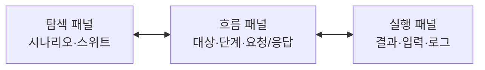
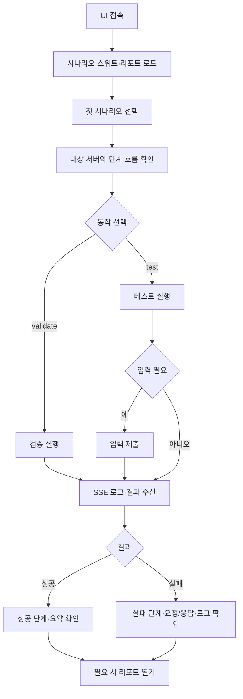
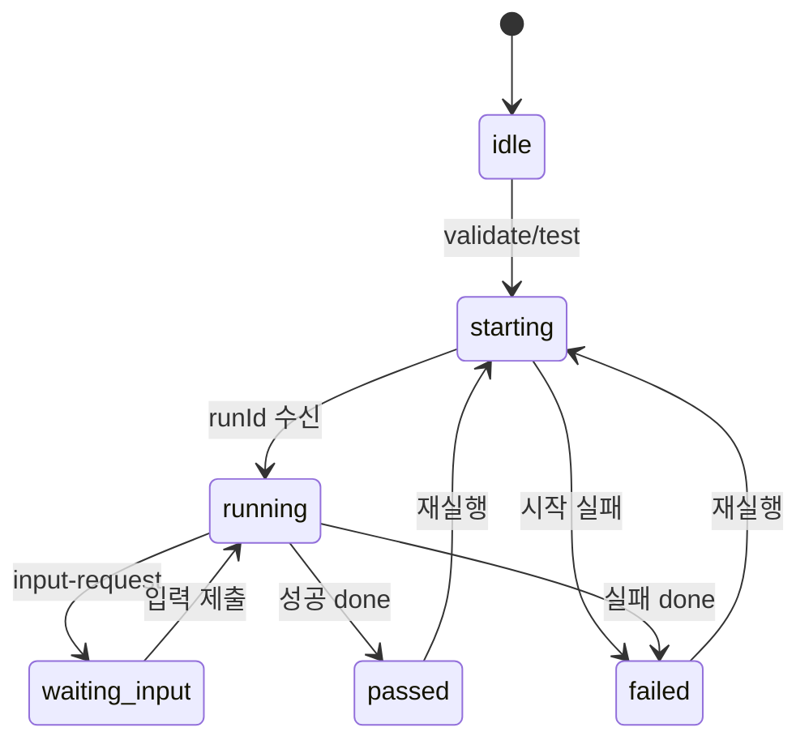

# React/Astryx UI 재작성 계획

- 작성일: 2026-07-30
- 기준 커밋: `bf8961b`
- 범위: `openapi-k6 ui` 프런트엔드
- 목표: 시나리오 엔드포인트 흐름을 빠르게 읽고, 검증·실행·결과 확인까지 한 화면에서 끝낸다.
- 진행 상태: 1단계 완료, 2단계 대기

## 1. 결정 사항

- 기존 UI의 색상, 카드 형태, 시각 스타일은 유지하지 않는다.
- React와 Astryx Neutral 테마를 사용해 프런트엔드를 다시 작성한다.
- CLI, YAML 문법, 시나리오 실행기, k6 변환기, 기존 HTTP/SSE 계약은 유지한다.
- UI는 시나리오 작성기가 아니다. 탐색, 실행 전 확인, 실행, 결과·리포트 확인에 집중한다.
- 같은 정보를 여러 영역에 반복하지 않는다. 기존의 `실행 예정 엔드포인트`와 `시나리오 실행 단계`는 하나의 단계 흐름으로 합친다.
- 범용 동작은 아이콘으로 줄이되, 의미가 모호한 실행 동작과 핵심 정보는 글자를 유지한다.
- React 전환 중에는 기존 화면을 유지하고 `/next/`에서 새 화면을 검증한다. 기능 동등성 확인 후 `/`만 전환한다.

## 2. 사용자와 완료 기준

### 주요 사용자

- 시나리오 작성자: YAML이 의도한 API 순서와 입력·추출·검증 구조를 확인한다.
- 실행자: 대상 서버를 확인하고 validate/test를 실행한다.
- 문제 분석자: 실패한 단계, 요청·응답, 로그, 리포트를 확인한다.

### 진입점

```bash
openapi-k6 ui
```

서버는 기존처럼 loopback 주소에서 시작하고, 터미널에 접속 URL을 출력한다. 브라우저 자동 실행은 추가하지 않는다.

### 완료 기준

사용자가 다음을 추가 화면 이동 없이 수행할 수 있어야 한다.

1. 시나리오 또는 스위트를 검색하고 선택한다.
2. 대상 모듈·base URL과 API 호출 순서를 실행 전에 확인한다.
3. 필요한 경우 계획된 요청과 예상 응답을 펼쳐 본다.
4. validate 또는 test를 실행하고 필요한 입력을 제출한다.
5. 성공·실패 단계, 실제 요청·응답, 로그, 리포트를 확인한다.

## 3. 디자인 원칙

### 정보 우선순위

1. 선택한 시나리오와 실행 대상
2. 단계별 HTTP method·path·상태
3. 실패 원인과 요청·응답
4. 원본 YAML과 상세 로그

설명 문장보다 구조와 상태를 먼저 보인다. 긴 설명은 선택한 시나리오 상단에 한 번만 노출한다.

### Astryx 사용 기준

| 목적 | Astryx 구성 요소 | 규칙 |
| --- | --- | --- |
| 앱 프레임 | `AppShell`, `Layout`, `LayoutPanel` | 카드 묶음 대신 화면 전체를 패널로 분할한다. |
| 패널 너비 | `ResizeHandle`, `useResizable` | 데스크톱에서만 제공하고 키보드 조작을 지원한다. |
| 탐색 | `TabList`, `TextInput`, `TreeList` | 행 간격을 작게 하고 선택 상태를 명확히 표시한다. |
| 상태 | `StatusDot`, `Token` | 색만 사용하지 않고 상태 글자를 함께 표시한다. |
| 동작 | `Button`, `IconButton`, `Tooltip` | 한 화면의 primary 버튼은 `test` 하나만 둔다. |
| 로그·원문 | `CodeBlock`, `SyntaxTheme` | 임의의 어두운 박스를 만들지 않고 제공 테마를 쓴다. |
| 리포트 | `Dialog` 또는 `Drawer` | 목록 화면을 가리지 않는 최소 크기로 연다. |

### 아이콘과 글자

아이콘만 사용하는 동작:

- 새로고침
- 폴더 전체 접기·펼치기
- 패널 접기
- 복사
- 지우기
- 닫기
- 요청·응답 숨기기·보기
- 리포트 열기·다운로드

모든 `IconButton`에는 접근성 label과 tooltip을 둔다. 상태 아이콘은 상태 글자 없이 단독 사용하지 않는다.

글자를 유지하는 항목:

- `validate`, `test`
- `시나리오`, `스위트`, `탐색`, `흐름`, `실행`, `로그`
- HTTP method와 endpoint path
- 대상 모듈과 base URL
- 실행 상태, 오류, 입력 요청

## 4. 목표 화면 구조

### 데스크톱



- 적용 기준: viewport 너비 `1100px` 초과
- 탐색 패널: 기본 300, 최소 260, 최대 480
- 실행 패널: 기본 420, 최소 360, 최대 640
- 흐름 패널: 남은 공간을 사용하며 최소 480
- 패널 너비는 민감하지 않은 UI 설정으로 localStorage에 저장한다.

### 모바일·좁은 화면

- 적용 기준: viewport 너비 `1100px` 이하
- 세 패널을 세로로 길게 쌓지 않는다.
- 상단 `TabList`로 `탐색 | 흐름 | 실행` 중 하나만 표시한다.
- ResizeHandle은 숨긴다.
- 실행 중 입력 요청이나 실패가 생기면 `실행` 탭에 상태 표시를 추가하되 자동 이동은 하지 않는다.

### 상단 바

- 앱 이름
- 연결 상태: `연결됨`, `연결 끊김`
- 현재 config 대상 요약
- 리포트 수와 리포트 열기 아이콘
- 새로고침 아이콘

config 전체 내용을 반복하지 않는다. 기본 base URL은 상단에서 한 번 보여주고, 선택한 시나리오가 다른 모듈을 사용하면 흐름 패널의 대상 영역에서 차이만 표시한다.

### 탐색 패널

- `시나리오 | 스위트` 탭
- 검색 입력
- 전체 접기·펼치기 아이콘
- compact `TreeList`
- 각 행: 이름, 단계 수, 마지막 실행 상태
- 긴 이름은 말줄임하고 focus 또는 hover tooltip에서 전체 이름을 보여준다.

### 흐름 패널

- 선택 항목 이름과 설명
- 대상 모듈·base URL
- `validate` secondary 버튼, `test` primary 버튼
- 하나의 단계 목록

각 단계 행은 다음만 기본 표시한다.

```text
순번  상태  단계 이름                  출처
      METHOD /endpoint/path
```

단계를 펼치면 다음 순서로 표시한다.

1. 계획된 요청: headers, query, path, body
2. OpenAPI 기반 예상 응답
3. 추출·검증 규칙
4. 원본 YAML 조각
5. 실행 후 실제 요청·응답과 실패 원인

요청·응답 값은 기본으로 숨긴다. 보기 아이콘은 이 영역에 둔다. 민감 값은 실제 표시 모드에서도 기존 마스킹 규칙을 유지한다.

### 실행 패널

- `실행 | 로그` 탭
- 현재 실행 상태와 요약
- 대기 중인 사용자 입력 폼
- 최근 validate 결과와 최근 test 결과
- 로그 `CodeBlock`
- 복사·지우기 아이콘

서버가 단계별 중간 상태 이벤트를 제공하지 않으므로, 실행 중에는 전체 실행 상태와 스트리밍 로그를 표시한다. 단계별 성공·실패는 최종 `test-result` 또는 `suite-result` 수신 후 반영한다. 지원되지 않는 취소 버튼은 만들지 않는다.

## 5. 사용자 흐름



### 초기 로드

1. 시나리오, 스위트, 리포트를 병렬로 읽는다.
2. 첫 유효 시나리오를 선택한다.
3. 선택한 상세 정보와 서버 상태를 읽는다.
4. config 또는 scenario 파일 변경은 기존처럼 다음 API 조회 시 반영한다. 파일 watcher는 추가하지 않는다.
5. 일부 목록 조회가 실패하면 성공한 영역은 유지하고 실패한 영역만 재시도할 수 있게 한다.

### 선택과 미리보기

1. 사용자가 시나리오를 선택한다.
2. 대상 모듈과 최종 base URL을 표시한다.
3. 실행 전에 모든 단계의 method와 endpoint를 표시한다.
4. 단계 펼치기 시 실제 값이 없는 필드는 YAML 변수명, OpenAPI schema 예시, 마스킹 값으로 구조를 보여준다.
5. OpenAPI 해석에 실패해도 YAML 기반 기본 상세는 유지한다.

### 실행과 입력

1. 실행 버튼을 누르면 중복 실행을 막고 `시작 중` 상태로 전환한다.
2. run ID를 받으면 SSE에 연결하고 `실행 중`으로 전환한다.
3. `input-request` 수신 시 실행 패널에 입력 폼을 표시한다.
4. 민감 입력은 password input을 사용하고 저장하지 않는다.
5. 입력 제출 후 SSE 수신을 계속한다.
6. 연결이 재개되면 서버가 재전송한 chunk, result, pending input, done 이벤트를 중복 없이 반영한다.

### 결과와 리포트

1. validate와 test의 최신 결과를 각각 메모리에 유지한다.
2. 최종 결과를 단계 목록과 실행 요약에 반영한다.
3. suite test는 시나리오별 결과와 집계 상태를 표시한다.
4. 리포트 목록은 필터, 열기, 복사, 다운로드만 제공한다.
5. 새 영속 저장소를 만들지 않는다. 새로고침하면 비영속 실행 기록은 사라진다.

### 연결 끊김

1. UI 서버 연결 실패를 감지하면 상단 상태를 `연결 끊김`으로 바꾼다.
2. 실행·입력 동작을 비활성화하고 현재 화면은 유지한다.
3. 기존 주기인 5초마다 복구를 확인한다.
4. 복구되면 목록과 선택 상세를 다시 읽는다.

## 6. 상태 모델



전역 연결 상태는 실행 상태와 분리한다. 연결이 끊겨도 마지막 화면과 결과를 지우지 않는다.

| 상태 영역 | 값 |
| --- | --- |
| bootstrap | `loading`, `ready`, `error`, `disconnected` |
| selection | `none`, `scenario`, `suite` |
| run | `idle`, `starting`, `running`, `waiting_input`, `passed`, `failed` |
| report | `closed`, `loading`, `ready`, `error` |
| mobile view | `explorer`, `flow`, `run` |

## 7. 데이터 보존 범위

| 위치 | 저장 항목 | 저장하지 않는 항목 |
| --- | --- | --- |
| localStorage | 접힌 그룹, 패널 너비, 마지막 모바일 탭 | 입력값, 요청·응답, 로그, secret |
| React 메모리 | 목록, 선택, 상세, 최신 실행 결과, SSE 상태 | 새로고침 후 복원용 실행 기록 |
| 기존 서버 메모리 | 실행 process, chunk, 결과, 대기 입력 | 새 영속 데이터 |
| 기존 report 파일 | 기존 suite report 데이터 | request/response body 추가 저장 |

## 8. 유지할 기존 계약

새 API를 설계하지 않는다. React 화면은 다음 기존 계약을 그대로 사용한다.

| 구분 | 기존 계약 |
| --- | --- |
| 목록·상세 | `GET /api/scenarios`, `/api/scenario`, `/api/suites`, `/api/suite` |
| 대상 확인 | `POST /api/check-servers` |
| 실행 | `POST /api/run`, `POST /api/run-suite` |
| 스트림·입력 | `GET /api/runs/:id/events`, `POST /api/runs/:id/input` |
| 리포트 | `GET /api/reports`, `/api/report`, `/api/report/html`, `/api/report/download` |
| SSE 이벤트 | `chunk`, `test-result`, `suite-result`, `input-request`, `input-submitted`, `done` |

다음 동작도 바꾸지 않는다.

- `BASE_URL_<MODULE>`부터 OpenAPI server URL까지의 기존 base URL 우선순위
- 멀티 모듈 scenario의 단계별 target module 계산
- 첫 실패에서 scenario 중단, suite는 다음 scenario 계속 실행
- 기존 config, `.env`, scenario YAML, scaffold와 CLI 옵션
- report ID 검증, 경로 제한, 민감 정보 마스킹
- 인증이 없는 loopback 기본 바인딩

## 9. 단계별 구현 계획

각 단계는 별도 커밋으로 끝낸다. 다음 단계는 이전 단계의 검증이 통과한 뒤 시작한다.

### 1단계 — React 빌드 기반

범위:

- React, React DOM, StyleX peer를 직접 의존성으로 명시한다.
- React, Astryx, Vite 등 번들 빌드 전용 패키지는 devDependency로 둔다.
- UI 전용 TypeScript/Vite 설정과 `build:ui`를 추가한다.
- Astryx `AppShell`만 렌더링하는 최소 엔트리를 만든다.
- 빌드 산출물을 `dist/cli/ui/app/**`에 둔다.
- 자산 URL은 `/ui-assets/**`로 고정해 `/next/`와 최종 `/`가 같은 번들을 사용한다.
- 서버가 `import.meta.url` 기준으로 정적 자산을 안전하게 제공하도록 한다.
- 기존 `/`는 유지하고 `/next/`에서 새 UI를 연다.

완료·검증:

- `/next/`, 해시된 JS/CSS가 200과 올바른 MIME으로 응답한다.
- 경로 이탈과 dotfile 요청을 거부한다.
- npm pack 결과에 UI 자산이 포함된다.
- 기존 `/`와 기존 테스트가 그대로 동작한다.

### 2단계 — 프레임과 탐색

범위:

- 상단 바, 데스크톱 3패널, 모바일 탭을 구현한다.
- 시나리오·스위트 목록, 검색, TreeList, 선택을 연결한다.
- config 대상 요약과 서버 상태를 표시한다.
- 패널 너비와 접힌 그룹만 localStorage에 저장한다.

완료·검증:

- 긴 이름, 빈 목록, 오류 항목, 134개 이상 목록에서 탐색 가능하다.
- 마우스와 키보드로 패널 크기 변경과 TreeList 이동이 가능하다.
- 모바일에서 한 패널만 보이고 주요 동작에 접근할 수 있다.

### 3단계 — 시나리오 단계 흐름

범위:

- 중복 목록을 제거하고 중앙 단계 흐름 하나로 합친다.
- method, endpoint, source, target module을 기본 행에 표시한다.
- 계획 요청, 예상 응답, 추출·검증, YAML 상세를 펼침 영역에 표시한다.
- 요청·응답 보기 아이콘과 민감 값 마스킹을 적용한다.

완료·검증:

- 실행 전 모든 endpoint 순서를 확인할 수 있다.
- 단일·멀티 모듈의 최종 대상이 정확히 보인다.
- OpenAPI snapshot 누락·오류 시에도 YAML 상세가 보인다.

### 4단계 — 실행과 SSE

범위:

- validate/test 실행, 실행 상태, 스트리밍 로그를 연결한다.
- SSE 재연결과 서버 replay를 처리한다.
- 사용자 입력 요청과 제출을 구현한다.
- 최종 결과를 단계와 실행 요약에 반영한다.

완료·검증:

- 성공, 첫 단계 실패, 명령 시작 실패가 구분된다.
- 입력 대기 중 새로 연결해도 pending input이 다시 보인다.
- validate/test 최신 결과가 서로 덮어쓰지 않는다.
- 요청·응답 기본 숨김과 secret 비저장이 확인된다.

### 5단계 — 스위트·리포트·복구

범위:

- suite 실행 결과와 집계를 구현한다.
- 리포트 목록, 필터, 열기, 복사, 다운로드를 구현한다.
- UI 서버 연결 끊김과 복구 처리를 구현한다.
- 접근성, overflow, 큰 로그·응답 렌더링을 다듬는다.

완료·검증:

- 일부 scenario 실패 후에도 suite 결과 전체가 보인다.
- 기존 report 파일을 그대로 읽고 다운로드한다.
- 연결 끊김 중 실행이 막히고 화면은 유지되며 복구 후 갱신된다.
- 아이콘 버튼이 label, tooltip, focus 상태를 가진다.

### 6단계 — 기능 동등성 확인과 전환

범위:

- 기존 UI와 React UI의 핵심 사용자 흐름을 비교한다.
- HTML 문자열 검사 테스트를 사용자 행동 중심 테스트로 교체한다.
- `/`를 React UI로 전환한다.
- 전환 커밋 하나만 되돌리면 기존 UI로 복구되게 유지한다.

완료·검증:

- scenario/suite 선택부터 실행·입력·결과·report까지 브라우저 검증이 통과한다.
- 설치된 tarball에서 UI와 API/SSE가 동작한다.
- 기존 CLI 호환성 검증이 통과한다.

### 7단계 — 기존 UI 제거

범위:

- 안정화 확인 후 `html.ts`와 임시 `/next/`·legacy 경로를 제거한다.
- 문서와 배포 smoke를 최종 상태로 갱신한다.

완료·검증:

- 배포 tarball에 사용하지 않는 기존 UI가 없다.
- clean install, build, pack, 실행이 재현된다.

## 10. 검증과 롤백

단계별 최소 검증:

```bash
pnpm test
pnpm build
pnpm run smoke:e2e
pnpm run test:compat
npm pack --dry-run
```

React 동작 테스트는 컴포넌트 내부 구현이 아니라 다음 사용자 행동을 기준으로 작성한다.

- 검색·선택·접기·패널 resize·모바일 탭
- 실행 요청·SSE event·입력 제출·최종 결과
- 요청·응답 숨김·마스킹
- 리포트 열기·다운로드
- 연결 끊김·복구

배포 smoke는 실제 tarball을 설치한 임시 디렉터리에서 UI 서버를 시작하고 `/`, JS, CSS, API, SSE를 확인한다. UI 전환은 routing-only 커밋으로 분리해 문제가 생기면 해당 커밋만 되돌린다.

## 11. 예외와 우선순위

### 전환 전 필수

- TSX/DOM 전용 설정과 React peer 직접 의존성
- 패키지 내부 정적 자산 경로, MIME, 경로 이탈 방어
- 기존 inline HTML 문자열 테스트의 행동 테스트 전환
- SSE 재연결·replay·입력 대기 처리
- secret 마스킹과 비저장
- 기존 CLI/scaffold/config/YAML 호환성

### 중요

- 단일·멀티 모듈 대상 표시
- snapshot 누락·OpenAPI 오류 fallback
- 긴 이름과 endpoint overflow
- 큰 로그·response body 성능
- 키보드 focus와 icon tooltip
- 기존 report 형식 호환

### 초기 범위 제외

- UI에서 scenario/config 편집
- 실행 취소
- 실행 기록 영속 저장
- 파일 watcher와 push 갱신
- 사용자 계정·원격 바인딩·인증
- 다크 모드와 별도 브랜드 테마

## 12. 관련 소스와 도구

현재 주요 소스:

- `src/cli/ui/html.ts`
- `src/cli/ui/server.ts`
- `src/cli/ui/server-http.ts`
- `test/cli.test.ts`
- `package.json`

Astryx 설계 확인 명령:

```bash
pnpm exec astryx build "시나리오 기반 API 테스트 실행 UI"
pnpm exec astryx template ide --skeleton
pnpm exec astryx template incident-console --skeleton
pnpm exec astryx docs layout
pnpm exec astryx component AppShell
pnpm exec astryx component TreeList
pnpm exec astryx component IconButton
pnpm exec astryx component ResizeHandle
pnpm exec astryx hook useResizable
```

막힌 결정은 없다. 구현 중 기존 API로 표현할 수 없는 필수 상태가 확인될 때만 API 변경을 별도 검토한다.

플로우 문서를 기준으로 다음 단계는 별도 API 상세 리뷰입니다.
