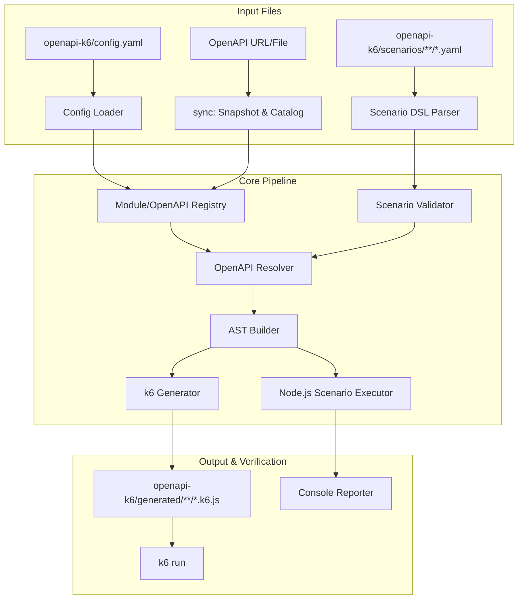

# openapi-k6-runner 프로젝트 리뷰

이 문서는 `openapi-k6-runner` 저장소와 npm package `openapi-k6`의 현재 구조, 실행 흐름, 검증 범위, 호환성 원칙을 인수인계 관점에서 정리한다. 사용자용 사용법은 루트 [README](../README.md)를 기준으로 하고, 이 문서는 유지보수자가 전체 맥락을 빠르게 파악할 때 사용한다.

## 1. 아키텍처와 실행 흐름

`openapi-k6`는 k6 JavaScript를 직접 작성하기 전에 API 흐름을 Scenario YAML로 선언하고 검증하는 CLI다. 사용자는 로그인, 응답 값 추출, 인증 API 호출 같은 흐름을 YAML로 작성한다. CLI는 이 YAML을 OpenAPI snapshot과 정적으로 대조하고, Node.js에서 실제 백엔드에 1회 실행해본 뒤, 통과한 scenario만 k6 스크립트로 생성하거나 `k6 run`까지 실행한다.



대표 흐름은 다음과 같다.

```text
init -> sync -> catalog -> scenario YAML 작성 -> validate -> test -> run/generate
```

## 2. 저장소 구조

주요 소스는 역할별로 분리되어 있다.

```text
src/
├── cli/
│   ├── index.ts
│   └── test.reporter.ts
├── config/
│   └── load-test.config.ts
├── core/
│   ├── module-env.ts
│   ├── template.ts
│   └── types.ts
├── parser/
│   └── scenario.parser.ts
├── validator/
│   └── scenario.validator.ts
├── openapi/
│   ├── openapi.catalog.ts
│   ├── openapi.parser.ts
│   └── openapi.resolver.ts
├── executor/
│   └── scenario.executor.ts
├── compiler/
│   ├── ast.builder.ts
│   └── k6.generator.ts
├── scaffold/
│   ├── load-test.init.ts
│   └── templates/openapi-k6.README.md
└── utils/
    └── jsonpath.ts
```

## 3. 핵심 컴포넌트

### 설정과 module scoping

- `openapi-k6/config.yaml`에서 root `baseUrl`, `defaultModule`, `modules.<name>`을 읽는다.
- 단일 module은 기존 `--module`, `defaultModule`, 단일 module 추론 순서로 동작한다.
- 멀티모듈 scenario는 step의 `api.module`로 module을 명시한다.
- 생성된 k6 스크립트는 module 이름을 기준으로 `BASE_URL_AUTH`, `BASE_URL_BOS_API` 같은 환경변수를 우선 사용한다.

### Scenario parsing과 정적 검증

- YAML/JSON Scenario DSL을 파싱한다.
- `auth/login` 같은 폴더형 scenario key는 `openapi-k6/scenarios/auth/login.yaml`로 해석하고, 생성물과 로그도 같은 하위 폴더 구조를 유지한다.
- `steps` 안의 `- use: auth/login`을 scenario root 기준의 재사용 scenario steps로 펼친다.
- `steps` 안의 `- include: ./partials/login.yaml`을 entry scenario 디렉터리 안의 공통 step 파일로 펼친다.
- entry scenario의 `vars:`와 `fixtures:`, CLI `--var-file`/`--var` override를 `{{vars.NAME}}` template 값으로 제공해 include partial과 본문 step이 같은 테스트 데이터를 공유하게 한다.
- `operationId` 또는 `method + path`가 OpenAPI snapshot에 존재하는지 확인한다.
- 필수 path/query/header parameter와 request body 또는 multipart 입력을 검증한다.
- `{{token}}` 같은 context template이 이전 step의 `extract`에서 만들어졌는지 확인한다.
- `{{env.NAME}}`은 runtime 환경값으로 취급하고 문법만 검증한다.
- `condition` 표현식과 `extract.from` JSONPath가 지원 범위인지 확인한다.

### Node.js live executor

- Scenario를 Node.js에서 순차 실행한다.
- 실제 URL, header, query, path parameter, body, multipart 구성이 백엔드에 전달되는지 확인한다.
- 응답에서 `extract` 값을 context에 저장하고 다음 step template에 연결한다.
- 실패한 status, condition, extract, response body 일부를 console reporter가 표시한다.

### k6 generator와 run orchestration

- Scenario AST를 dependency-free k6 JavaScript로 생성한다.
- JSONPath, URL join, masking helper를 생성 script 안에 포함한다.
- `{{env.SECRET}}` 참조는 k6 runtime의 `__ENV.SECRET` 접근으로 컴파일하고 로그 masking 대상으로 등록한다.
- `openapi-k6 run`은 validate, generate, `k6 run`을 한 번에 실행하며 `--log`, `--trace`, `--report`, `--open-dashboard`를 지원한다.

## 4. 검증 체계

| 명령 | 범위 | 목적 |
| --- | --- | --- |
| `pnpm test` | Vitest unit/integration | DSL parsing, config loading, OpenAPI catalog/resolver, static validation, executor, generator, CLI 동작 검증 |
| `pnpm run smoke:e2e` | Local backend E2E | 서로 다른 로컬 포트의 seed/auth/bos fixture 서버로 `init -> module add --sync -> validate -> test -> generate -> run` 흐름 검증 |
| `pnpm run test:compat` | Backward compatibility smoke | 로컬 tarball을 `npm exec --package`로 실행해 기존 npm/npx 사용 흐름 검증 |
| `pnpm run smoke:published -- openapi-k6@<version>` | Published package smoke | npm registry에 배포된 실제 package의 `--version`, `--help`, `init`, standalone `validate/generate` 검증 |
| `npm --cache /private/tmp/npm-cache pack --dry-run` | Packaging | npm tarball에 포함되는 파일과 package metadata 확인 |

`smoke:e2e`는 단순히 같은 서버의 경로만 나누지 않는다. seed, auth, bos를 각각 다른 `127.0.0.1:<port>` 서버로 띄우고, auth의 OpenAPI fallback discovery와 bos의 기본 OpenAPI discovery, 그리고 `auth.login -> bos.createOrder` cross-module API 호출이 실제로 각 서버에 들어갔는지 확인한다.

## 5. 하위 호환성 원칙

이 프로젝트는 npm/npx로 배포되는 CLI이므로 기존 사용자의 workflow가 깨지지 않는 것이 중요하다.

- 기존 공개 명령의 의미를 바꾸지 않는다: `init`, `update`, `sync`, `catalog`, `validate`, `test`, `generate`, `run`.
- 기존 공개 옵션의 의미를 바꾸지 않는다: `-s/--scenario`, `-o/--openapi`, `-w/--write`, `--config`, `-m/--module`, `--no-input`, `--force`.
- 기본 작업공간은 `openapi-k6/`이며, 기존 기본 `load-tests/config.yaml` workspace는 `update` 때 `openapi-k6/`로 이전한다.
- 새 기능은 기본적으로 additive하게 추가한다.
- compatibility가 흔들릴 수 있는 변경은 `pnpm run test:compat`와 published smoke 관점에서 검증한다.
- `openapi-k6/.openapi-k6.json` metadata로 scaffold 버전을 기록하고, 오래된 scaffold에서 `validate`, `test`, `generate`, `run`을 실행하면 `Scaffold update available` 안내와 `update` 명령만 표시한다.
- breaking change가 필요하면 구현 전에 migration 방안과 문서 변경을 먼저 확정한다.

## 6. 현재 상태와 다음 후보

현재 기능은 scenario-first CLI의 주요 흐름을 갖췄다. 특히 scenario vars/fixtures, 폴더형 scenario key, scenario-root `use`, reusable step include, `api.module`, module 관리 CLI, `doctor`, `run` 명령, 정적 template 검증, published smoke, 멀티서버 E2E smoke까지 연결되어 있다.

남은 개선 후보는 다음과 같다.

- UI adapter용 export/convert 경계 정리
- 실제 UI flow model fixture 확보 후 Scenario DSL 변환기 추가
- 더 많은 OpenAPI schema validation coverage
- scenario 작성 보조 명령 강화
- release 후 published smoke와 GitHub Actions 결과를 유지보수 문서에 더 자동으로 연결
